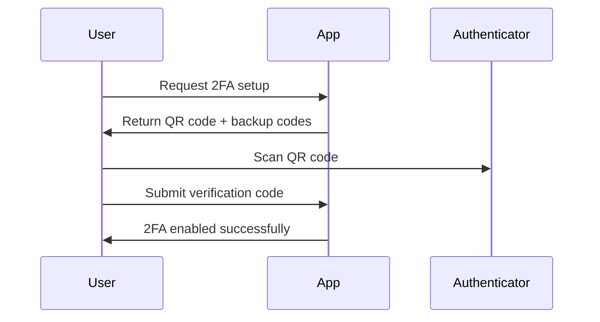
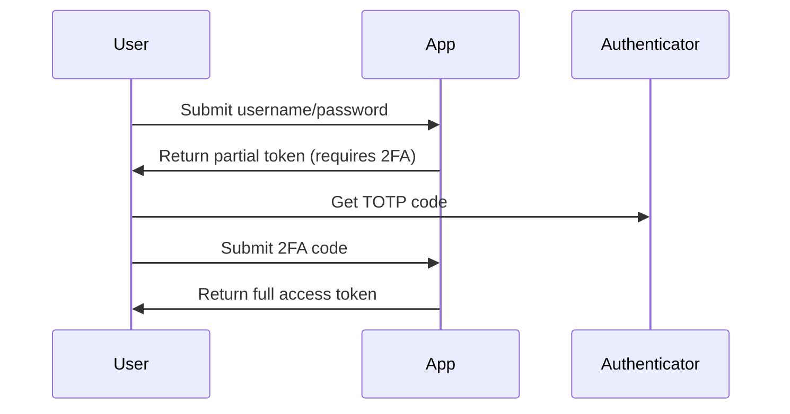

# Two-Factor Authentication (2FA) Guide

This guide covers the implementation and usage of Two-Factor Authentication in the AI Road Trip Storyteller application.

## Overview

Two-Factor Authentication adds an extra layer of security by requiring users to provide two forms of identification:
1. **Something they know** (password)
2. **Something they have** (authenticator app or backup codes)

## Features

- **TOTP Support**: Time-based One-Time Passwords using authenticator apps
- **Backup Codes**: One-time use recovery codes
- **QR Code Setup**: Easy setup with QR code scanning
- **Rate Limiting**: Protection against brute force attacks
- **Session Management**: Secure session handling after 2FA verification

## User Flow

### 1. Enabling 2FA



### 2. Login with 2FA



## API Endpoints

### Setup 2FA

```http
POST /api/auth/2fa/setup
Authorization: Bearer <access_token>

Response:
{
    "qr_code": "data:image/png;base64,...",
    "secret": "JBSWY3DPEHPK3PXP",
    "backup_codes": [
        "ABCD-1234",
        "EFGH-5678",
        ...
    ],
    "setup_complete": false
}
```

### Enable 2FA

```http
POST /api/auth/2fa/enable
Authorization: Bearer <access_token>
Content-Type: application/json

{
    "code": "123456"
}

Response:
{
    "message": "Two-factor authentication enabled successfully",
    "enabled": true,
    "enabled_at": "2024-01-15T10:30:00Z"
}
```

### Verify 2FA (During Login)

```http
POST /api/auth/2fa/verify
Content-Type: application/json

{
    "session_id": "temp_session_id",
    "user_id": "user_uuid",
    "code": "123456"  // Or use "backup_code": "ABCD-1234"
}

Response:
{
    "verified": true,
    "backup_codes_remaining": 8
}
```

### Disable 2FA

```http
POST /api/auth/2fa/disable
Authorization: Bearer <access_token>
Content-Type: application/json

{
    "password": "current_password"
}

Response:
{
    "message": "Two-factor authentication disabled successfully",
    "enabled": false
}
```

### Check 2FA Status

```http
GET /api/auth/2fa/status
Authorization: Bearer <access_token>

Response:
{
    "enabled": true,
    "enabled_at": "2024-01-15T10:30:00Z",
    "last_used": "2024-01-15T14:20:00Z",
    "backup_codes_count": 8
}
```

### Regenerate Backup Codes

```http
POST /api/auth/2fa/backup-codes/regenerate
Authorization: Bearer <access_token>

Response:
{
    "backup_codes": [
        "NEWC-0DE1",
        "NEWC-0DE2",
        ...
    ],
    "generated_at": "2024-01-15T15:00:00Z"
}
```

## Mobile App Integration

### Setup Flow

```typescript
// mobile/src/services/twoFactorService.ts
export class TwoFactorService {
    async setupTwoFactor(): Promise<TwoFactorSetup> {
        const response = await apiClient.post('/auth/2fa/setup');
        return {
            qrCode: response.data.qr_code,
            secret: response.data.secret,
            backupCodes: response.data.backup_codes
        };
    }
    
    async enableTwoFactor(code: string): Promise<void> {
        await apiClient.post('/auth/2fa/enable', { code });
    }
}
```

### Login Flow

```typescript
// mobile/src/services/authService.ts
export class AuthService {
    async login(email: string, password: string): Promise<LoginResult> {
        const response = await apiClient.post('/auth/token', {
            username: email,
            password
        });
        
        if (response.data.requires_2fa) {
            // Store partial token and redirect to 2FA screen
            return {
                requires2FA: true,
                partialToken: response.data.partial_token,
                sessionId: response.data.session_id,
                userId: response.data.user_id
            };
        }
        
        // Normal login flow
        return {
            requires2FA: false,
            accessToken: response.data.access_token,
            refreshToken: response.data.refresh_token
        };
    }
    
    async verify2FA(sessionId: string, userId: string, code: string): Promise<TokenPair> {
        const response = await apiClient.post('/auth/2fa/verify', {
            session_id: sessionId,
            user_id: userId,
            code
        });
        
        return {
            accessToken: response.data.access_token,
            refreshToken: response.data.refresh_token
        };
    }
}
```

### UI Components

```tsx
// mobile/src/screens/TwoFactorSetupScreen.tsx
export const TwoFactorSetupScreen: React.FC = () => {
    const [qrCode, setQrCode] = useState<string>('');
    const [backupCodes, setBackupCodes] = useState<string[]>([]);
    const [verificationCode, setVerificationCode] = useState('');
    
    const handleSetup = async () => {
        const setup = await twoFactorService.setupTwoFactor();
        setQrCode(setup.qrCode);
        setBackupCodes(setup.backupCodes);
    };
    
    const handleEnable = async () => {
        await twoFactorService.enableTwoFactor(verificationCode);
        navigation.navigate('Settings');
    };
    
    return (
        <View>
            {qrCode && (
                <>
                    <Image source={{ uri: qrCode }} style={styles.qrCode} />
                    <Text>Scan with your authenticator app</Text>
                    <TextInput
                        value={verificationCode}
                        onChangeText={setVerificationCode}
                        placeholder="Enter 6-digit code"
                        keyboardType="numeric"
                        maxLength={6}
                    />
                    <Button title="Enable 2FA" onPress={handleEnable} />
                </>
            )}
        </View>
    );
};
```

## Security Considerations

### Rate Limiting

- **Setup**: 5 attempts per hour per user
- **Verification**: 10 attempts per 5 minutes
- **Disable**: 3 attempts per hour

### Backup Codes

- Generated using cryptographically secure random
- Stored as bcrypt hashes in database
- Single use only (removed after use)
- 10 codes generated by default

### TOTP Configuration

- **Algorithm**: SHA-1 (standard for compatibility)
- **Period**: 30 seconds
- **Digits**: 6
- **Window**: ±1 period (allows for clock drift)

### Database Schema

```sql
-- User table 2FA fields
ALTER TABLE users ADD COLUMN two_factor_enabled BOOLEAN DEFAULT FALSE;
ALTER TABLE users ADD COLUMN two_factor_secret VARCHAR(255);
ALTER TABLE users ADD COLUMN two_factor_backup_codes JSON;
ALTER TABLE users ADD COLUMN two_factor_enabled_at TIMESTAMP;
ALTER TABLE users ADD COLUMN two_factor_last_used TIMESTAMP;
```

## Best Practices

### For Users

1. **Use a reputable authenticator app**:
   - Google Authenticator
   - Microsoft Authenticator
   - Authy
   - 1Password

2. **Store backup codes securely**:
   - Print and store in a safe place
   - Use a password manager
   - Don't store with your password

3. **Enable on all important accounts**:
   - Especially for admin/premium accounts

### For Developers

1. **Never log or expose secrets**:
   ```python
   # Bad
   logger.info(f"2FA secret: {user.two_factor_secret}")
   
   # Good
   logger.info(f"2FA setup initiated for user {user.id}")
   ```

2. **Use constant-time comparison**:
   ```python
   # Using bcrypt for backup codes (constant-time)
   bcrypt.checkpw(code, hashed_code)
   ```

3. **Clear sensitive data**:
   ```python
   # Clear secret after disabling 2FA
   user.two_factor_secret = None
   user.two_factor_backup_codes = []
   ```

## Troubleshooting

### Common Issues

1. **"Invalid code" errors**:
   - Check device time synchronization
   - Ensure correct timezone
   - Try adjacent time windows

2. **Lost authenticator app**:
   - Use backup codes
   - Contact support for identity verification
   - Consider SMS backup (future feature)

3. **QR code not scanning**:
   - Use manual entry with secret key
   - Check camera permissions
   - Ensure adequate lighting

### Admin Tools

```python
# Admin endpoint to check 2FA status
@router.get("/admin/users/{user_id}/2fa-status")
async def get_user_2fa_status(
    user_id: str,
    admin: User = Depends(get_current_admin_user),
    db: Session = Depends(get_db)
):
    user = db.query(User).filter(User.id == user_id).first()
    return {
        "user_id": user_id,
        "2fa_enabled": user.two_factor_enabled,
        "enabled_at": user.two_factor_enabled_at,
        "last_used": user.two_factor_last_used,
        "backup_codes_remaining": len(user.two_factor_backup_codes or [])
    }
```

## Monitoring

### Metrics to Track

1. **2FA Adoption Rate**:
   ```sql
   SELECT 
       COUNT(*) FILTER (WHERE two_factor_enabled) AS enabled_users,
       COUNT(*) AS total_users,
       ROUND(100.0 * COUNT(*) FILTER (WHERE two_factor_enabled) / COUNT(*), 2) AS adoption_rate
   FROM users;
   ```

2. **Failed Verification Attempts**:
   - Track in application logs
   - Alert on suspicious patterns
   - Consider blocking after threshold

3. **Backup Code Usage**:
   - Monitor when codes are low
   - Prompt users to regenerate

## Future Enhancements

1. **SMS Backup**: For users without smartphones
2. **Hardware Token Support**: YubiKey, etc.
3. **Biometric Integration**: FaceID/TouchID on mobile
4. **Risk-Based Authentication**: Require 2FA for suspicious logins
5. **Account Recovery**: Secure recovery without 2FA

## Compliance

The 2FA implementation helps meet compliance requirements for:
- **PCI DSS**: Multi-factor authentication for admin access
- **SOC 2**: Access control requirements
- **GDPR**: Data protection through strong authentication
- **HIPAA**: When handling health-related journey data